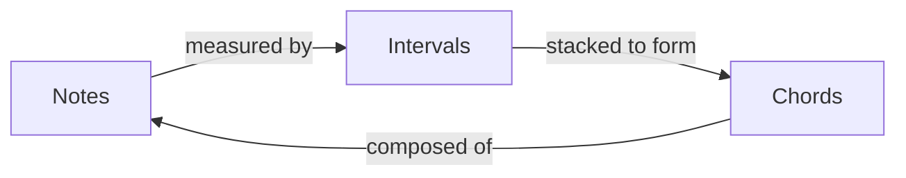

A **chord** is ==three or more [[Music-Notes|notes]] played together==. Chords are built by stacking [[Music-Intervals|intervals]] on top of a **root note**.

<!-- more -->

## How Chords Are Built

Chords are constructed from [[Music-Intervals|intervals]] — specifically by stacking **3rds**:

```
Major Chord = Root + Major 3rd + Perfect 5th
Minor Chord = Root + Minor 3rd + Perfect 5th
```

## The Four Basic Triads

| Chord Type | Formula          | Example (C root) | Sound           |
| :--------- | :--------------- | :--------------- | :-------------- |
| Major      | Root + M3 + P5   | C - E - G        | Happy, bright   |
| Minor      | Root + m3 + P5   | C - Eb - G       | Sad, dark       |
| Diminished | Root + m3 + dim5 | C - Eb - Gb      | Tense, unstable |
| Augmented  | Root + M3 + aug5 | C - E - G#       | Mysterious      |

## Seventh Chords

Adding another [[Music-Intervals|3rd interval]] on top of a triad creates a **seventh chord**:

| Chord Type       | Formula                  | Example (C root)  |
|:-----------------|:-------------------------|:-------------------|
| Major 7th        | Root + M3 + P5 + M7      | C - E - G - B      |
| Dominant 7th     | Root + M3 + P5 + m7      | C - E - G - Bb     |
| Minor 7th        | Root + m3 + P5 + m7      | C - Eb - G - Bb    |
| Diminished 7th   | Root + m3 + dim5 + dim7  | C - Eb - Gb - A    |

## How They All Connect

> [!abstract] Summary
> - **[[Music-Notes|Notes]]** are individual sounds
> - **[[Music-Intervals|Intervals]]** describe the distance between notes
> - **Chords** are groups of notes built by stacking intervals
>
> Notes → Intervals → Chords


